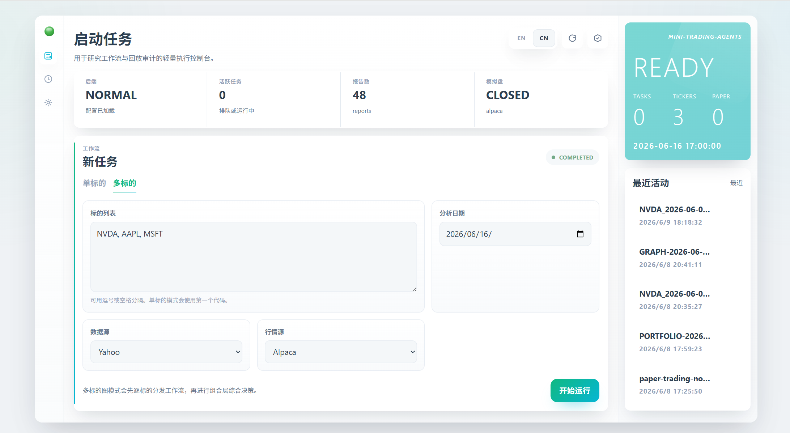
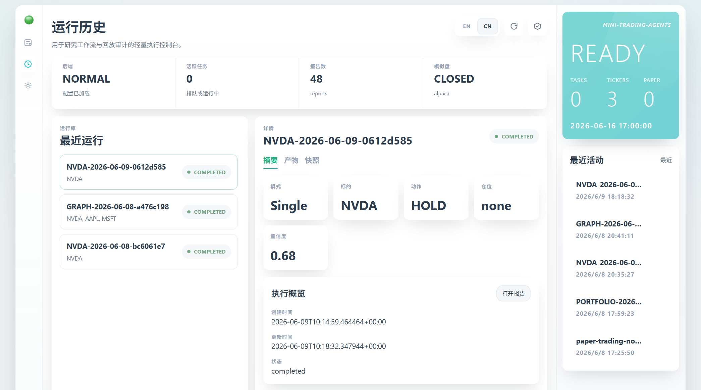
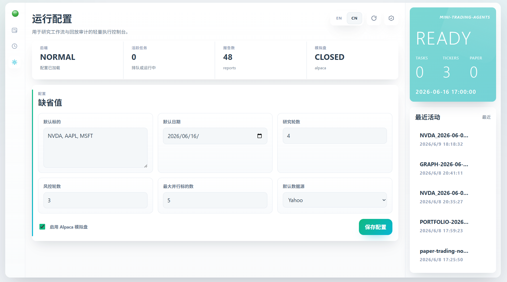
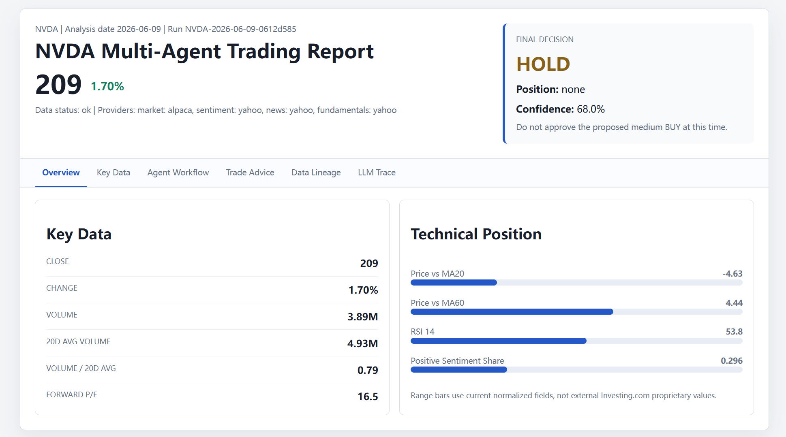
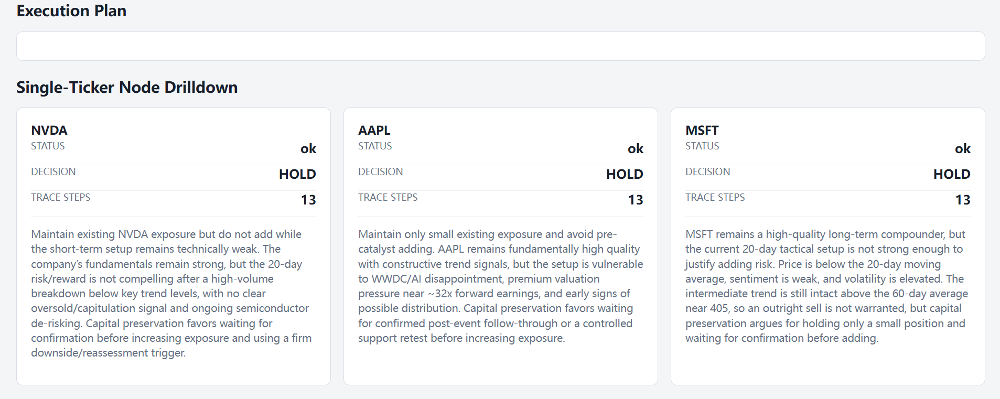

# Mini Trading Agents

English | [中文](README.zh-CN.md)

A minimal LangGraph skeleton inspired by TradingAgents.

This system extends the TradingAgents-style single-symbol research workflow
into a multi-ticker portfolio management workflow. Users can provide a target
universe of securities together with capital and risk constraints, and the
system produces position-management guidance, target allocation proposals, and
portfolio-level execution plans. In this sense, the project is moving from
single-name trading assistance toward a personal fund-management assistant.

The next development direction is long-running automated operation: scheduled
analysis, continuous portfolio monitoring, paper execution feedback, and
agent-driven maintenance of the investment universe. Over time, agents should
be able to recommend new candidates, remove deteriorating holdings from the
watchlist or portfolio, and keep the target universe aligned with the user's
capital mandate and risk profile.

The framework also includes audit-oriented infrastructure for replay and
recovery. LangGraph checkpoints preserve graph execution progress, custom
snapshots persist complete workflow states for historical review, and decision
memory records portfolio outcomes for later analysis. Paper trading is supported
through Alpaca Paper Trading, so strategy decisions can be tested against a
broker-hosted simulated account before any live-trading integration is
considered.

It focuses on three core ideas:

- Multiple role-specific agents run in a graph workflow.
- Agents share information through one mutable workflow state.
- Later agents synthesize reports, debates, proposals, and risk reviews.
- Analyst nodes run in parallel, while research and risk debate nodes loop for configurable rounds.
- Checkpoints, snapshots, and decision memory support run recovery, audit trails, and historical review.
- Alpaca Paper Trading provides an online simulated execution layer for validating portfolio decisions.

This is a research scaffold, not investment advice and not a live trading system.

## Showcase

The screenshots below show the current Vue operator console and the generated
HTML research reports.

| View | Preview |
| --- | --- |
| **Startup Console**<br>Main launch screen for choosing mode, ticker universe, analysis date, and providers. |  |
| **Run History**<br>Historical runs, status inspection, summary, artifacts, and snapshots. |  |
| **Runtime Configuration**<br>Editable non-secret runtime settings used by the service layer. |  |
| **Single-Ticker HTML Report**<br>Generated report for one ticker, including workflow trace and structured trade output. |  |
| **Multi-Ticker HTML Report**<br>Portfolio-level report with graph orchestration, synthesis, and allocation review. |  |

## Run

Install dependencies:

```powershell
python -m pip install -r requirements.txt
```

The project has two runtime modes:


| Mode                        | Entry point    | Default TOML  | Purpose                                                                                       |
| --------------------------- | -------------- | ------------- | --------------------------------------------------------------------------------------------- |
| Single-node / single-ticker | `run.py`       | `config.toml` | Run one ticker through the ticker-level agent graph. Uses the first value in `[run].tickers`. |
| Graph / multi-ticker        | `run_graph.py` | `config.toml` | Run a parent graph that dispatches multiple ticker subgraphs and produces an allocation plan. |


Create a local config from the tracked example:

```powershell
Copy-Item .\config.example.toml .\config.toml
```

Run single-node mode:

```powershell
python .\run.py
```

Run Graph mode:

```powershell
python .\run_graph.py
```

Run with local sample data:

```powershell
python .\run.py --ticker NVDA --date 2026-01-15
```

Run with Yahoo Finance adapters:

```powershell
python .\run.py --ticker NVDA --date 2026-01-15 --data-provider yahoo
```

Choose providers per data category:

```powershell
python .\run.py --ticker NVDA --date 2026-01-15 --market-provider yahoo --sentiment-provider yahoo --news-provider yahoo --fundamentals-provider yahoo
```

`--data-provider` is a shortcut that sets all four categories. Category-specific flags override it.

## Configuration Reference

Runtime TOML should contain runtime settings only. `config.toml` is used by
both `run.py` and `run_graph.py`. Secrets
live in `.env.openai` and `.env.alpaca`; detailed policy/profile objects live
in JSON files under `config/`.

### config.toml


| Section            | Key                            | Type         | Required | Allowed values                   | Default                                     | Description                                                                                 |
| ------------------ | ------------------------------ | ------------ | -------- | -------------------------------- | ------------------------------------------- | ------------------------------------------------------------------------------------------- |
| `[config_files]`   | `trade_preferences_path`       | string path  | No       | any JSON file path               | `config/trade_preferences.default.json`     | Investor/trading preference profile used by ticker-level advice agents.                     |
| `[config_files]`   | `constraints_path`             | string path  | No       | any JSON file path               | `config/portfolio_constraints.default.json` | Portfolio hard-constraint policy file.                                                      |
| `[persistence]`    | `checkpoint_enabled`           | bool         | No       | `true`, `false`                  | `true`                                      | Enables LangGraph native checkpoint persistence.                                            |
| `[persistence]`    | `checkpoint_path`              | string path  | No       | any SQLite path                  | `storage/langgraph_checkpoints.sqlite`      | SQLite file for LangGraph checkpoints.                                                      |
| `[persistence]`    | `snapshot_enabled`             | bool         | No       | `true`, `false`                  | `true`                                      | Enables custom complete-state snapshots after streamed `values` chunks.                     |
| `[persistence]`    | `snapshot_path`                | string path  | No       | any SQLite path                  | `storage/workflow_snapshots.sqlite`         | SQLite file used by `SnapshotStore`.                                                        |
| `[persistence]`    | `decision_memory_enabled`      | bool         | No       | `true`, `false`                  | `true`                                      | Enables decision memory writes to LangGraph Store and business audit records.               |
| `[persistence]`    | `memory_store_path`            | string path  | No       | any SQLite path                  | `storage/langgraph_memory.sqlite`           | SQLite file for LangGraph Store long-term memory.                                           |
| `[persistence]`    | `storage_path`                 | string path  | No       | any SQLite path                  | `storage/trading_agents.sqlite`             | Business database for memory copies, trade outcomes, and paper execution records.           |
| `[llm]`            | `provider`                     | string       | No       | `openai`                         | `openai`                                    | LLM adapter provider.                                                                       |
| `[llm]`            | `model`                        | string       | Yes      | model name supported by provider | empty                                       | Model used by all LLM-backed agents.                                                        |
| `[paper_trading]`  | `enable`                       | bool         | No       | `true`, `false`                  | `false`                                     | If true, submits validated execution plans to the configured paper adapter.                 |
| `[paper_trading]`  | `provider`                     | string       | No       | `alpaca`                         | `alpaca`                                    | Online paper trading adapter.                                                               |
| `[run]`            | `tickers`                      | list[string] | No       | ticker symbols                   | `["NVDA", "AAPL", "MSFT"]`                  | Portfolio runner uses all; single-ticker runner uses the first unless `--ticker` overrides. |
| `[run]`            | `analysis_date`                | string       | No       | `""` or `YYYY-MM-DD`             | `""`                                        | Empty string resolves to today's local date.                                                |
| `[run]`            | `research_turns`               | int          | No       | positive integer                 | `4`                                         | Bull/bear research debate turns for ticker graphs.                                          |
| `[run]`            | `risk_turns`                   | int          | No       | positive integer                 | `6`                                         | Risk debate turns for ticker graphs.                                                        |
| `[run]`            | `max_parallel_tickers`         | int          | No       | positive integer                 | `5`                                         | Maximum ticker subgraphs dispatched in one parent-graph batch.                              |
| `[data_providers]` | `default`                      | string       | No       | `sample`, `yahoo`                | `sample`                                    | Default provider for categories without a specific override.                                |
| `[data_providers]` | `market`                       | string       | No       | `sample`, `yahoo`, `alpaca`      | `default`                                   | Market data provider.                                                                       |
| `[data_providers]` | `sentiment`                    | string       | No       | `sample`, `yahoo`                | `default`                                   | Sentiment data provider.                                                                    |
| `[data_providers]` | `news`                         | string       | No       | `sample`, `yahoo`                | `default`                                   | News data provider.                                                                         |
| `[data_providers]` | `fundamentals`                 | string       | No       | `sample`, `yahoo`                | `default`                                   | Fundamentals data provider.                                                                 |
| `[logging]`        | `enabled`                      | bool         | No       | `true`, `false`                  | `true`                                      | Enables JSONL streaming audit logs.                                                         |
| `[logging]`        | `log_dir`                      | string path  | No       | any directory path               | `logs`                                      | Directory for JSONL logs.                                                                   |
| `[reporting]`      | `report_dir`                   | string path  | No       | any directory path               | `reports`                                   | Directory for generated HTML reports.                                                       |
| `[portfolio]`      | `max_revision_count`           | int          | No       | `0` or positive integer          | `2`                                         | Maximum LLM portfolio-plan repair attempts after validation fails.                          |
| `[portfolio]`      | `single_ticker_failure_policy` | string       | No       | `fail_fast`, `skip_failed`       | `fail_fast`                                 | Parent graph behavior when a ticker subgraph fails.                                         |


### Environment Files


| File          | Key                     | Type       | Required            | Description                                                   |
| ------------- | ----------------------- | ---------- | ------------------- | ------------------------------------------------------------- |
| `.env.openai` | `OPENAI_API_KEY`        | string     | Yes                 | OpenAI-compatible API key used by LLM agents.                 |
| `.env.openai` | `OPENAI_BASE_URL`       | string URL | No                  | OpenAI-compatible endpoint; leave empty for provider default. |
| `.env.alpaca` | `ALPACA_API_KEY`        | string     | Required for Alpaca | Alpaca key used by paper trading and market data.             |
| `.env.alpaca` | `ALPACA_API_SECRET`     | string     | Required for Alpaca | Alpaca secret used by paper trading and market data.          |
| `.env.alpaca` | `ALPACA_PAPER_BASE_URL` | string URL | No                  | Alpaca Paper Trading API endpoint.                            |


### JSON Policy Files

`config/portfolio_constraints.default.json`:


| Key                           | Type         | Required | Allowed values          | Default | Description                                            |
| ----------------------------- | ------------ | -------- | ----------------------- | ------- | ------------------------------------------------------ |
| `long_only`                   | bool         | No       | `true`, `false`         | `true`  | Rejects short allocations when true.                   |
| `allow_fractional`            | bool         | No       | `true`, `false`         | `true`  | Allows fractional share quantities.                    |
| `max_tickers`                 | int          | No       | positive integer        | `20`    | Maximum ticker count accepted by preflight validation. |
| `max_single_position_pct`     | number       | No       | `0.0` to `1.0`          | `0.25`  | Maximum target weight for one ticker.                  |
| `max_total_equity_pct`        | number       | No       | `0.0` to `1.0`          | `0.85`  | Maximum total non-cash equity exposure.                |
| `cash_reserve_pct`            | number       | No       | `0.0` to `1.0`          | `0.05`  | Minimum cash reserve target.                           |
| `max_turnover_pct`            | number       | No       | `0.0` to `1.0`          | `0.2`   | Maximum portfolio turnover for one execution plan.     |
| `max_sector_exposure_pct`     | number       | No       | `0.0` to `1.0`          | `0.45`  | Maximum sector exposure placeholder.                   |
| `max_theme_exposure_pct`      | number       | No       | `0.0` to `1.0`          | `0.45`  | Maximum theme exposure placeholder.                    |
| `max_correlation_cluster_pct` | number       | No       | `0.0` to `1.0`          | `0.5`   | Maximum exposure to a correlated cluster placeholder.  |
| `max_new_positions`           | int          | No       | `0` or positive integer | `5`     | Maximum new positions created in one plan.             |
| `min_order_value`             | number       | No       | positive number         | `100`   | Minimum order value before execution handoff.          |
| `cooldown_days_after_loss`    | int          | No       | `0` or positive integer | `0`     | Reserved cooldown window after a loss.                 |
| `no_trade_symbols`            | list[string] | No       | ticker symbols          | `[]`    | Tickers rejected by preflight validation.              |


`config/trade_preferences.default.json`:


| Key                     | Type   | Required | Allowed values                                              | Default    | Description                                             |
| ----------------------- | ------ | -------- | ----------------------------------------------------------- | ---------- | ------------------------------------------------------- |
| `risk_profile`          | string | No       | `conservative`, `balanced`, `aggressive`                    | `balanced` | Investor risk posture used in prompts and trade advice. |
| `trading_style`         | string | No       | `staged`, `left_side`, `right_side`, `breakout`, `pullback` | `staged`   | Preferred entry/add/reduce style.                       |
| `target_return_pct`     | number | No       | positive number                                             | `0.12`     | Target return over the configured holding window.       |
| `max_drawdown_pct`      | number | No       | positive number                                             | `0.08`     | Preferred maximum drawdown tolerance.                   |
| `expected_holding_days` | int    | No       | positive integer                                            | `20`       | Holding horizon used by expected return/risk fields.    |


Enable real LLM-backed decision nodes by editing local `config.toml`:

```toml
[llm]
provider = "openai"
model = "gpt-5.5"
```

Copy the OpenAI secret template and fill local `.env.openai`:

```powershell
Copy-Item .\.env.openai.example .\.env.openai
notepad .\.env.openai
```

```env
OPENAI_API_KEY=...
OPENAI_BASE_URL=https://bfstudy.pro
```

Then run:

```powershell
python .\run.py --ticker NVDA --date 2026-06-05
```

Local `.env.openai` is ignored by git. Keep OpenAI keys and private endpoints
there rather than in `config.toml`.

Every role node uses the configured OpenAI-compatible LLM with structured JSON output. This includes analysts, bull/bear researchers, research manager, trader, risk debaters, and portfolio manager.

If an LLM call fails, the workflow stops with an error. There is no automatic fallback in LLM mode.

The runner sends one small LLM check before the graph starts. This catches unavailable LLM services before data preparation, debate loops, and other workflow work begin.

Data provider status can be:

- `ok`: all requested data categories came from the selected provider.
- `partial`: at least one data category fell back to sample data.
- `fallback`: reserved for future hard provider-level fallback handling.

Yahoo currently fills all four data categories:

- market: historical prices and derived technical indicators.
- sentiment: market-proxy sentiment from ticker momentum plus VIX.
- news: Yahoo Finance news normalized into `NewsData`.
- fundamentals: Yahoo `info` and financial statements normalized into `FundamentalsData`.

Yahoo news and sentiment are useful for this system, but still lightweight. Production use should add SEC filings, a dedicated news API, and a real social/news sentiment model.

Each run writes a JSONL audit log to `logs/` by default:

```powershell
python .\run.py --ticker NVDA --date 2026-01-15 --pretty
Get-Content .\logs\<generated-file>.jsonl
```

Disable logs when you only want console output:

```powershell
python .\run.py --no-log
```

Each successful run also writes a self-contained HTML report to `reports/`. The report includes quote-page style key data, clickable section navigation, an interactive agent workflow explorer, synchronized workflow/diagram/summary highlighting, multi-round debate loops, data lineage, LLM usage, headline metrics, and lightweight data charts. `reports/` is ignored by git because the files are run artifacts.

Each normalized data slice includes lightweight lineage metadata. The lineage records provider, adapter, raw source, fetch time, downstream analyst, optional raw reference, and key transforms used to derive fields such as moving averages, sentiment score, news sentiment, and fundamentals ratios.

## Data Lineage Design

The current lineage model is intentionally lightweight. It is data-slice-level lineage, not full decision-DAG lineage.

Each normalized data object carries a `lineage` field:

```text
provider/raw source
  -> adapter
  -> normalized data fields
  -> analyst node
```

This is enough for the current workflow because the system has a short data path, limited iteration depth, and no repeated reuse of the same data slice across many independent decision branches. At this stage the most important audit questions are:

- where the data came from.
- which adapter fetched or normalized it.
- which fields were derived and how.
- which analyst consumed the data.
- whether the HTML report can trace conclusions back to the source data slice.

The current implementation does not yet model the full downstream decision graph:

```text
raw_data_id
  -> normalized_data_id
  -> analyst_report_id
  -> debate_turn_id
  -> trader_proposal_id
  -> risk_assessment_id
  -> final_decision_id
```

That heavier DAG-style lineage should be added later if the system starts doing long-running simulation, repeated backtests, multi-source fusion, distributed execution, or historical impact analysis where one bad upstream data point must be traced across many reports, debates, and decisions.

## Alpaca Paper Trading

The paper trading layer is independent from the agent workflow. Agents still only produce `final_trade_decision`, `trade_advice`, and portfolio execution plans; the execution layer consumes the final state after the graph finishes.

```text
final_trade_decision
  -> AlpacaPaperAdapter
  -> Alpaca paper order / account / position refresh
  -> paper_trading_result
  -> HTML report
```

The online paper adapter currently targets Alpaca Paper Trading only:

- account context is read from Alpaca Paper before the portfolio graph runs.
- current cash, equity, and open positions are fed into the portfolio manager.
- portfolio execution plans submit Alpaca market orders.
- repeated runs use Alpaca `client_order_id` to avoid duplicate submissions for the same run/ticker.
- Alpaca remains the source of account, position, order, and portfolio-history data.

Enable it in local `config.toml`:

```toml
[paper_trading]
enable = true
provider = "alpaca"
```

Put Alpaca credentials in a separate local `.env.alpaca`:

```powershell
Copy-Item .\.env.alpaca.example .\.env.alpaca
notepad .\.env.alpaca
```

```env
ALPACA_API_KEY=...
ALPACA_API_SECRET=...
ALPACA_PAPER_BASE_URL=https://paper-api.alpaca.markets
```

When enabled, the HTML report includes a `Paper Trading` section with broker order status, account, position, and execution summary. Business audit records and `trade_outcomes` are still written to the configured SQLite business database, but broker state is no longer simulated locally.

The Alpaca adapter submits market day orders, uses `client_order_id` for run-level idempotency, refreshes account and position data after submission, and attempts to read one month of daily portfolio history for report metadata.

## Single-Ticker Trade Advice

The single-ticker graph should not decide final portfolio weights in a multi-asset system. Its job is to analyze one ticker and produce structured trade advice that a future parent portfolio graph can compare against other tickers.

Trade preferences come from local config:

```toml
[config_files]
trade_preferences_path = "config/trade_preferences.default.json"
```

The preference file is a JSON mandate/profile:

```json
{
  "risk_profile": "balanced",
  "trading_style": "staged",
  "target_return_pct": 0.12,
  "max_drawdown_pct": 0.08,
  "expected_holding_days": 20
}
```

The trader node now emits `trade_advice` with:

- action and conviction bucket: `BUY/HOLD/SELL` plus `none/small/medium/large`.
- trade intent: `open/add/reduce/exit/watch/wait`. `HOLD + watch` is the current observation/standby case.
- expected return, expected risk, and expected holding days. Return/risk values
are fractional values for that configured holding period, not annualized and
not 3/5/10-year projections, so `0.10` means 10% over `expected_holding_days`.
- risk profile and trading style.
- entry, add, reduce, and stop-loss plans.
- invalidation conditions.

`position_size` remains a conviction bucket for the single ticker, not a final
portfolio allocation. In multi-ticker mode, the parent portfolio graph is the
layer that converts multiple tickers' advice into precise `target_weight`
values under portfolio constraints before handing orders to Alpaca Paper.

## Global Portfolio Graph

`run_graph.py` runs a multi-ticker parent graph that treats the
single-ticker LangGraph as a reusable computation node. The parent graph fans
out ticker tasks, collects each ticker's `trade_advice`, builds portfolio
context, asks a portfolio manager for final target weights, validates hard
constraints, revises repairable plans, and emits an execution plan plus a
portfolio HTML report.

```powershell
python .\run_graph.py --config .\config.example.toml --tickers NVDA,AAPL,MSFT --date 2026-06-05 --data-provider sample
```

Use Alpaca for market data while leaving sentiment, news, and fundamentals on
the shortcut provider:

```powershell
python .\run_graph.py --config .\config.toml --tickers NVDA,AAPL,MSFT --date 2026-06-05 --data-provider yahoo --market-provider alpaca
```

The same run can be controlled entirely from `config.toml`:

```toml
[run]
tickers = ["NVDA", "AAPL", "MSFT"]
analysis_date = ""
research_turns = 2
risk_turns = 3
max_parallel_tickers = 5

[data_providers]
default = "yahoo"
market = "alpaca"
sentiment = "yahoo"
news = "yahoo"
fundamentals = "yahoo"

[logging]
enabled = true
log_dir = "logs"

[reporting]
report_dir = "reports"
```

Then run:

```powershell
python .\run_graph.py --config .\config.toml
```

When `[run].analysis_date` is an empty string, the runners use today's local
date. Set `analysis_date = "2026-06-05"` to pin a specific analysis date.
The single-ticker runner uses the first value in `[run].tickers`.

Alpaca market data reuses the Alpaca key/secret from `.env.alpaca`, but calls
the market data host `https://data.alpaca.markets` instead of the paper trading
host.

The portfolio manager uses the configured LLM. Hard constraints are checked
before ticker fan-out and again after the portfolio plan:

```toml
[config_files]
constraints_path = "config/portfolio_constraints.default.json"

[portfolio]
max_revision_count = 2
single_ticker_failure_policy = "fail_fast"
```

Portfolio hard constraints live in a separate JSON policy file so the main
runtime config stays readable:

```json
{
  "long_only": true,
  "max_single_position_pct": 0.25,
  "max_total_equity_pct": 0.85,
  "cash_reserve_pct": 0.05,
  "max_turnover_pct": 0.2,
  "max_new_positions": 5,
  "min_order_value": 100
}
```

The parent graph now has three validation layers:

- `preflight_validate`: checks ticker list, no-trade symbols, data provider
config, LLM config, and portfolio constraint sanity before expensive work.
- `validate_portfolio_plan`: checks target weights, cash reserve, long-only,
single-position caps, max new positions, and plan turnover.
- `validate_execution_plan`: checks order-level feasibility such as turnover and
minimum order value before execution handoff.

`load_account_context` reads account cash, equity, positions, and portfolio
history from the Alpaca Paper API. There is no offline paper-account fallback. The
global report includes cross-section rankings, action distribution, risk and
execution validation, single-ticker node drilldown, target weights, and planned
orders.

`run_graph.py` uses LangGraph streaming with checkpoint, custom
snapshot, and decision memory/store support, matching the single-ticker runner's
persistence model. Portfolio-level memory events use
`scope_type = "portfolio"` and `scope_id = "global"`.

The LLM portfolio manager is the soft decision layer. Deterministic validation is
the hard constraint layer. The validator should not silently invent a portfolio;
it classifies violations and either routes to revision or rejects an infeasible
plan with the partial ticker results preserved.

Control debate loops:

```powershell
python .\run.py --research-turns 4 --risk-turns 6
```

Persist snapshots and decision memory:

```powershell
python .\run.py --ticker NVDA --date 2026-06-05 --run-id nvda-run-001
python .\run.py --resume nvda-run-001
```

Snapshots are written through `SnapshotStore` to `storage/workflow_snapshots.sqlite` by default. Each streamed full-state `values` chunk is saved as a recoverable snapshot there, so prior runs can be inspected, compared, and resumed from the latest complete state. Decision memory is written to LangGraph Store at `storage/langgraph_memory.sqlite`; `BusinessStore` writes to `storage/trading_agents.sqlite` for business records such as `decision_memory`, `memory_events`, trade outcomes, and paper execution rows.

Persistence is configured in local `config.toml`. The three persistence layers are all enabled by default:

- `checkpoint_enabled`: LangGraph native checkpoints keyed by `thread_id`.
- `snapshot_enabled`: custom complete-state snapshots after streamed `values` chunks.
- `decision_memory_enabled`: final portfolio decisions saved to LangGraph Store, with an audit copy in custom SQLite.

Use a different config file when needed:

```powershell
python .\run.py --config .\config.toml --ticker NVDA
```

## Workflow

```text
Prepare Data
        |
        v
Market Analyst
Sentiment Analyst
News Analyst
Fundamentals Analyst
        |
        v
Bull Researcher <-> Bear Researcher
        |
        v
Research Manager
        |
        v
Trader
        |
        v
Aggressive / Neutral / Conservative Risk Debaters
        |
        v
Portfolio Manager
```

## Files

- `mini_trading_agents/state.py`: shared workflow state structures.
- `mini_trading_agents/data_layer/`: data acquisition, cleaning, and structuring layer.
- `mini_trading_agents/data_layer/market/`: market data adapters.
- `mini_trading_agents/data_layer/sentiment/`: sentiment data adapters.
- `mini_trading_agents/data_layer/news/`: news data adapters.
- `mini_trading_agents/data_layer/fundamentals/`: fundamentals data adapters.
- `mini_trading_agents/workflow.py`: LangGraph workflow with parallel analysts and debate loops.
- `mini_trading_agents/config.py`: TOML config loader for persistence features.
- `mini_trading_agents/llm_adapter/`: provider adapters for optional LLM-backed decision nodes.
- `mini_trading_agents/logging.py`: JSONL run logger for streamed graph events.
- `mini_trading_agents/storage/`: custom SQLite snapshots and decision memory.
- `mini_trading_agents/agents.py`: role implementations.
- `config.example.toml`: safe example config for local `config.toml`.
- `run.py`: single-node/single-ticker entry point.
- `run_graph.py`: graph-mode multi-ticker entry point.

## Extending

Replace the deterministic report logic in `agents.py` with calls to an LLM. Add more adapters under the relevant data category directory, such as `mini_trading_agents/data_layer/news/`, and have `prepare_data` write normalized inputs into `TradingState` before the analyst fan-out.
